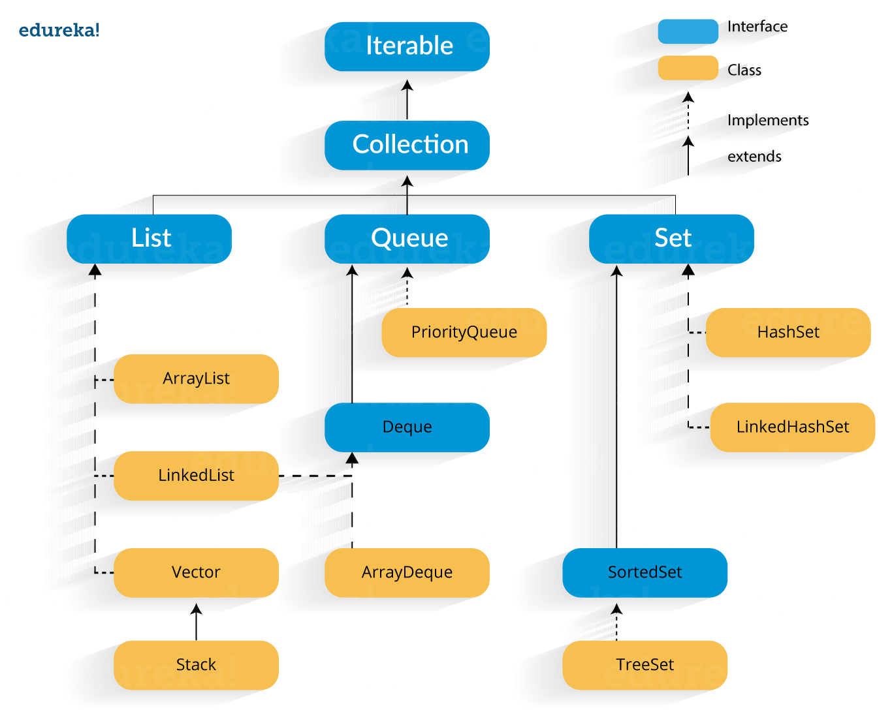

# Java Collection Framework (컬렉션 프레임워크)

## 컬렉션 프레임워크 (Collection Framework) 이란?

  자바에서 데이터 군을 저장하는 클래스들을 표준화 한 설계를 말한다. 즉, 객체나 데이터들을 효율적으로 관리하기 위해서 사용하는 라이브러리이다. java.util 패키지에 포함된 인터페이스들 (List, Set, Map, Queue, Stack 등)을 구현한 클래스들이 컬렉션 프레임워크로 사용된다. 어떤 컬렉션은 중복된 원소를 허용하는 경우도 있고, 중복을 허용하지 않는 경우도 있다.


## 컬렉션 프레임워크의 핵심 인터페이스 - List, Set, Map

  컬렉션 프레임워크에서는 컬렉션을 크게 3가지 타입으로 나누어 3개의 핵심 인터페이스를 정의하였다. 3개의 핵심 인터페이스는 




```java
public interface Collection<E> extends Iterable<E>
```

- Type Parameter
  - E : 해당 컬렉션의 요소 타입
- SuperInterface
  - Iterable <E>


- Methods

Java API Doc 8에서 볼 수 있는 Collection 클래스의 메소드는 다음과 같다.

| Modifier and Type | Method and Description                                       |
| ----------------- | ------------------------------------------------------------ |
| boolean           | add(E e)<br />컬렉션에 요소 e를 추가                         |
| boolean           | addAll(Collection<? extends E> c)<br />컬렉션에 요소 c를 추가 |
| void              | clear()<br />                                                |
| boolean           | contains(Obeject o)                                          |
|                   |                                                              |
|                   |                                                              |
|                   |                                                              |
|                   |                                                              |
|                   |                                                              |
|                   |                                                              |
|                   |                                                              |
|                   |                                                              |
|                   |                                                              |
|                   |                                                              |
|                   |                                                              |
|                   |                                                              |
|                   |                                                              |
|                   |                                                              |

